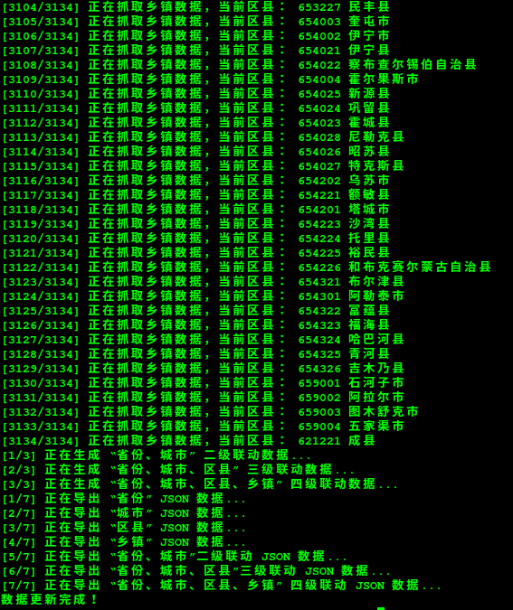

# Administrative-divisions-of-China

[](http://standardjs.com/)
[](https://david-dm.org/modood/Administrative-divisions-of-China)
[](https://www.npmjs.com/package/china-division)
[](https://www.npmjs.com/package/china-division)
[](https://raw.githubusercontent.com/modood/Administrative-divisions-of-China/master/LICENSE)

中华人民共和国行政区划：省份、城市、区县、乡镇（街道）

*   数据来源（国家统计局）：
    * [中华人民共和国国家统计局-行政区划代码](http://www.stats.gov.cn/tjsj/tjbz/xzqhdm/)
    * [中华人民共和国民政局-中华人民共和国行政区划代码](http://www.mca.gov.cn/article/sj/tjbz/a/)
    * [中华人民共和国国家统计局-统计用区划和城乡划分代码](http://www.stats.gov.cn/tjsj/tjbz/tjyqhdmhcxhfdm/)
*   标准：
    * [中华人民共和国行政区划](https://zh.wikipedia.org/wiki/%E4%B8%AD%E5%8D%8E%E4%BA%BA%E6%B0%91%E5%85%B1%E5%92%8C%E5%9B%BD%E8%A1%8C%E6%94%BF%E5%8C%BA%E5%88%92)
    * [中华人民共和国行政区划代码](https://zh.wikipedia.org/wiki/%E4%B8%AD%E5%8D%8E%E4%BA%BA%E6%B0%91%E5%85%B1%E5%92%8C%E5%9B%BD%E8%A1%8C%E6%94%BF%E5%8C%BA%E5%88%92%E4%BB%A3%E7%A0%81)
    * [中华人民共和国公民身份号码](https://zh.wikipedia.org/wiki/%E4%B8%AD%E5%8D%8E%E4%BA%BA%E6%B0%91%E5%85%B1%E5%92%8C%E5%9B%BD%E5%85%AC%E6%B0%91%E8%BA%AB%E4%BB%BD%E5%8F%B7%E7%A0%81)
    * [统计用区划代码和城乡划分代码编制规则](http://www.stats.gov.cn/tjsj/tjbz/200911/t20091125_8667.html)
*   本项目已更新至：
    * [最新县及县以上行政区划代码（截止时间：2016-07-31，发布时间：2017-03-10）](http://www.stats.gov.cn/tjsj/tjbz/xzqhdm/201703/t20170310_1471429.html)
    * [2016年统计用区划代码和城乡划分代码（截止时间：2016-07-31，发布时间：2017-05-16）](http://www.stats.gov.cn/tjsj/tjbz/tjyqhdmhcxhfdm/2016/index.html)

## JSON

| 文件列表                                     | 下载地址       |
|:---------------------------------------------|:---------------|
| 省份数据                                     | [provinces.json](https://github.com/modood/Administrative-divisions-of-China/blob/master/dist/provinces.json) |
| 城市数据                                     | [cities.json](https://github.com/modood/Administrative-divisions-of-China/blob/master/dist/cities.json) |
| 区县数据                                     | [areas.json](https://github.com/modood/Administrative-divisions-of-China/blob/master/dist/areas.json) |
| 乡镇（街道）数据                             | [streets.json](https://github.com/modood/Administrative-divisions-of-China/blob/master/dist/streets.json) |
| “省份、城市” 二级联动数据                    | [address2.json](https://github.com/modood/Administrative-divisions-of-China/blob/master/dist/address2.json) |
| “省份、城市、区县” 三级联动数据              | [address3.json](https://github.com/modood/Administrative-divisions-of-China/blob/master/dist/address3.json) |
| “省份、城市、区县、乡镇” 四级联动数据        | [address4.json](https://github.com/modood/Administrative-divisions-of-China/blob/master/dist/address4.json) |

## Usage

抓取并导出最新数据

```
$ npm install

$ npm run build
```



>  提示：
>
>  由于抓取乡镇数据为异步操作，每次输出的乡镇数据顺序可能不同
>
>  但是不会影响其它数据的顺序以及所有数据的完整性。

## TEST

```
$ npm test

> mocha -t 5000

  中华人民共和国行政区划：
    ✓ 省份数据
    ✓ 城市数据
    ✓ 区县数据
    ✓ 乡镇数据
    ✓ “省份、城市” 二级联动数据
    ✓ “省份、城市、区县” 三级联动数据
    ✓ “省份、城市、区县、乡镇” 四级联动数据
    ✓ “某省、某市、某县、某镇” 不存在

  8 passing (12ms)
```

## Contributing

1. Fork it
2. Create your feature branch (`git checkout -b my-new-feature`)
3. Commit your changes (`git commit -am 'Add some feature'`)
4. Push to the branch (`git push origin my-new-feature`)
5. Create new Pull Request

## License

this repo is released under the [MIT License](http://www.opensource.org/licenses/MIT).

